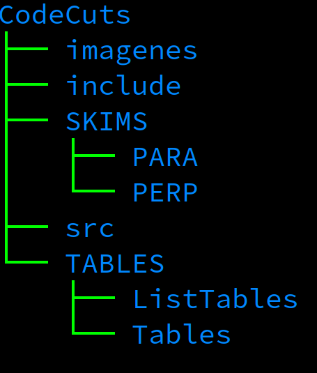

<!DOCTYPE html>

<html lang="es">
  <head>
    <meta charset="UTF-8"/>
  </head>
  <body>		
    <header>	
      <h1 align="center">FINAL WORK</h1>
      <h2 align="center">Data Analysis With ROOT/C++</h2>
    </header>
    

     
    <h1 align="center">¿How Use This Code?</h1>
    
To use this code you need has the directories into <em>CodeCuts</em>: 

    <ul>
      <li><em>Tables</em>, it has the polarization tables</li>
      <li><em>PARA</em> and <em>PERP</em> skims with the form <em>include/DataEvent.h</em></li>
    </ul>
    
    

     
    <h2>Files</h2>
    <ul>
      <li> In this file you can change all kinds of cuts and make all physics process, also fill the histograms</li>
      <li> In this file you can declare and define the histograms, also you can make the canvas</li>
      <li> In this file, you can put all kinds of #includes</li>
      <li> This file is only for compile</li>
    </ul>
    

     
    
To compile you need the version ROOTv6, and you can do it with two diffetent forms:

    <ol>
      <li><em>root -l -t -b Codigo.C</em> "-t" active the number of cores that you need (This line is in CodeCuts.h), and "-b" do it in the background (it doesn't show the graphics, but save them)</li>
      <li><em>root -l Codigo.C</em> This option would do if you have a good RAM</li>
    </ol>
     
    

    <h1 align="center">DESCRIPTION OF METHODS</h1>
    
There are three particles in each event. The first particle is a proton, the second is a positive kaon and the third is a negative pion, You can access the following info

    <ul>
      <li> TLorentzVector getEVNT_track(int i){return loc_EVNT_track->at(i);} //TLorentzVector for proton (i=0) kaon (i=1) and negative pion (i=2). The TlorentzVector has the nominal masses of the tracks.</li>
      <li> int getEVNT_q(int i){return loc_EVNT_q->at(i);} //charge for track i</li>
      <li> int getEVNT_scsec(int i){return loc_EVNT_scsec->at(i);} //SC sector for track i</li>
      <li> int getEVNT_scpad(int i){return loc_EVNT_scpad->at(i);} //SC paddle for track i</li>
      <li> int getEVNT_schit(int i){return loc_EVNT_schit->at(i);} //SC hit for track i</li>
      <li> int getEVNT_stsec(int i){return loc_EVNT_stsec->at(i);} //ST sector for track i</li>
      <li> int getEVNT_sthit(int i){return loc_EVNT_sthit->at(i);} //ST hit for track i</li>
      <li> int getTAGR_eid(int i){return loc_tagr_eid->at(i);} //TAGR eid for photon i</li>
      <li> int getTAGR_tid(int i){return loc_tagr_tid->at(i);} //TAGR tid for photon i</li>
      <li> int getTAGR_stat(int i){return loc_tagr_stat->at(i);} //TAGR status for photon i</li>
      <li> int getSTPB_sthid(int i){return loc_STPB_sthid->at(i);} //STBP hitd for track i</li>
      <li> int getSCPB_ScPdHt(int i){return loc_SCPB_ScPdHt->at(i);} //SCBP ScPdHt for track i</li>
      <li> float getEVNT_bem(int i){return loc_EVNT_bem->at(i);} //beta measured for track i</li>
      <li> float getEVNT_sc_t(int i){return loc_EVNT_sc_t->at(i);} //sc time for track i</li>
      <li> float getEVNT_sc_d(int i){return loc_EVNT_sc_d->at(i);} //sc d for track i</li>
      <li> float getEVNT_st_t(int i){return loc_EVNT_st_t->at(i);} //st time for track i</li>
      <li> float getEVNT_st_d(int i){return loc_EVNT_st_d->at(i);} //st d for track i</li>
      <li> float getEVNT_sc_e(int i){return loc_EVNT_sc_e->at(i);} //sc energy for track i </li>
      <li> float getTAGR_epho(int i){return loc_tagr_epho->at(i);} //TAGR epho for photon i </li>
      <li> float getTAGR_tpho(int i){return loc_tagr_tpho->at(i);} //TAGR tpho for photon i </li>
      <li> int getNum_photons(){return loc_tagr_tpho->size();} //number of photons </li>
      <li> int getTrip_flag(){return loc_trip_flag;} //trip flag </li>
      <li> int getNumofpart(){return loc_numofpart;} //number of particles (including neutrals) </li>
      <li> int getNum_pos(){return loc_num_pos;} //number of positive </li>
      <li> int getNum_chargedtracks(){return loc_EVNT_track->size();} //number of charged </li>
      <li> int getNum_neg(){return loc_num_neg;} //number of negative </li>
      <li> int getNum_neu(){return loc_num_neu;} //number of neutrals </li>
      <li> int getHEAD_eventnum(){return loc_head_eventnum;} //HEAD event number </li>
      <li> int getHEAD_runnum(){return loc_head_runnum;} //HEAD run number </li>
      <li> int getNum_deuterons(){return loc_num_deuterons;} //number of deuterons </li>
      <li> int getNum_protons(){return loc_num_protons;} //number of protons </li>
      <li> int getNum_poskaons(){return loc_num_poskaons;} //number of postive kaons </li>
      <li> int getNum_pospions(){return loc_num_pospions;} //number of positive pions </li>
      <li> int getNum_negkaons(){return loc_num_negkaons;} //number of negative kaons </li>
      <li> int getNum_negpions(){return loc_num_negpions;} ////number of negative pions </li>
      <li> float getCoh_edge(){return loc_coh_edge;} //Coherent Edge from EPICS </li>
      <li> float getBeam_en(){return loc_beam_en;} //Beam energy from EPICS </li>
      <li> float getCoh_edge_nom(){return loc_coh_edge_nom;} //Nominal Coherent Edge </li>
      <li> int getCoh_plan_db(){return loc_coh_plan_db;} //Coherent plane from database </li>
      <li> int getCoh_radi(){return loc_coh_radi;} //Coherent radiator from EPICS </li>
      <li> int getCoh_plan(){return loc_coh_plan;} //Coherent radiator from EPICS </li>
      <li> float getDelt_t_k(int i){return loc_delt_t_k->at(i);} //Photon i coincidence time with kaon </li>
      <li> float getDelt_t_pi(int i){return loc_delt_t_pi->at(i);} //Photon i coincidence time with pion </li>
      <li> int getNumph_k(){return loc_numph_k;} //Number of photons within 1ns when looking at the photon-kaon coincidence time </li>
      <li> int getNumph_pi(){return loc_numph_pi;} //Number of photons within 1ns when looking at the photon-pion coincidence time </li>
      <li> int getIndex_k(int i){return loc_index_k->at(i);} //Photon index when sorted using the photon-kaon coincidence time </li>
      <li> int getIndex_pi(int ip){return loc_index_pi->at(i);} //Photon index when sorted using the photon-pion coincidence time. getIndex_pi(0) returns the photon position that produces the smallest coincidence time </li>
      <li> TLorentzVector getKpi_mm(int i){return loc_kpi_mm->at(i);} // 4-vector g n ->K+ pi- X </li>
      <li> TLorentzVector getK_mm(int i){return loc_k_mm->at(i);} // 4-vector g n ->K+ X </li>
      <li> TLorentzVector getPpi_mm(int i){return loc_ppi_mm->at(i);} // 4-vector g n ->p pi- X when kaon is given proton mass </li>
      <li> TLorentzVector getPipi_mm(int i){return loc_pipi_mm->at(i);} // 4-vector g n ->pi+ pi- X when kaon is given pion mass </li>
      <li> TLorentzVector getDKppi_mm(int i){return loc_d_kppi_mm->at(i);} // 4-vector g d ->p K+ pi- X </li>
      <li> TLorentzVector getDKp_mm(int i){return loc_d_kp_mm->at(i);} // 4-vector g d ->p K+ X </li>
      <li> TVector3 getEVNT_vertex(int i){return loc_EVNT_vertex->at(i);} //EVNT vertex of i track </li>
      <li> TVector3 getMVRT_vertex(){return *loc_MVRT_vertex;} //MVRT vertex </li>
      <li> int getNextEntry(); </li>
      <li> int getEntry(){return eventno;} </li>
      <li> int getEntries(); </li>      
    </ul>

  </body>
</html>
